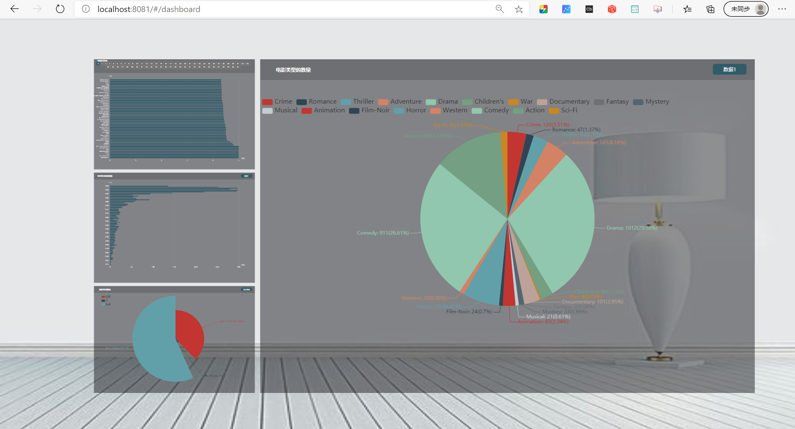
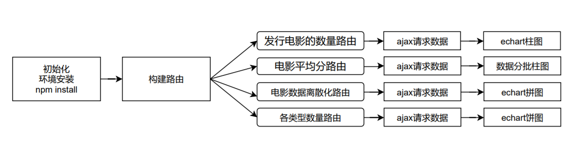

# Spark web “实时”电影数据分析与推荐

摘要：使用spark作为数据分析框架对电影数据进行统计分析与。spark缓存可以的数据避免IO平凡开销，使用经典版的spring boot的java web框架进行可视化，使用前端框架vue.js分离前后端,让程序有更好的扩展性。

关键字：spark；spring boot；java web；Scala web；vue.js

Abstract: Using spnalysis framework, the statistical analysis of film data and. Spark cache can avoid IO trivial
overhead, using the classic version of spring boot Java Web Framework for visualization, using the front-end framework
vue.js Separate the front and back end, so that the program has better scalability.

Keyword: Spark Spring boot Java web Scala web Vue.js

目录

[1 程序说明 7](#_Toc59719889)

> [1.1 程序概述 7](#_Toc59719890)

> [1.1.1 spark应用 7](#_Toc59719891)

> [1.1.2	spring boot	7](#_Toc59719892)

> [1.1.3	vue.js	7](#_Toc59719893)

> [1.2 程序流程 8](#_Toc59719894)

> [1.3 程序功能 8](#_Toc59719895)

> [1.3.1  API	8](#_Toc59719896)

> [1.3.2 可视化 11](#_Toc59719897)

> [1.3.3 推荐算法结果 14](#_Toc59719898)

[2 程序实现 15](#_Toc59719899)

> [2.1	spark sql 数据统计 15](#_Toc59719900)

> [2.1.1 读入电影数据创建DataFrame	15](#_Toc59719901)

> [2.1.2 读入评分数据创建DataFrame	16](#_Toc59719902)

> [2.1.3	init加载函数,注册临时表建立缓冲 16](#_Toc59719903)

> [2.1.4 每年发行电影的数量 16](#_Toc59719904)

> [2.1.5 每部电影的平均分 17](#_Toc59719905)

> [2.1.5 电影评分离散化 17](#_Toc59719906)

> [2.1.6 统计每种类型电影的数量 17](#_Toc59719907)

> [2.2	spark milib 电影推荐 17](#_Toc59719908)

> [2.2.1 设置运行环境 17](#_Toc59719909)

> [2.2.2 训练集与测试 18](#_Toc59719910)

> [2.2.3 模型训练 18](#_Toc59719911)

> [2.2.4 优化基线模型 18](#_Toc59719912)

> [2.2.5 电影推荐 19](#_Toc59719913)

> [2.3	spring boot	19](#_Toc59719914)

> [2.3.1 创建app	19](#_Toc59719915)

> [2.3.2 配置spring boot	19](#_Toc59719916)

> [2.3.3	spring boot 跨域 20](#_Toc59719917)

> [2.3.4 控制器代码 20](#_Toc59719918)

> [2.4	vue.js	21](#_Toc59719919)

> [2.4.1 路由控制 21](#_Toc59719920)

> [2.4.2 年发布可视化 23](#_Toc59719921)

> [2.4.3 平均评分可视化 24](#_Toc59719922)

> [2.4.4 离散数据可视化 25](#_Toc59719923)

> [2.4.5每种类型电影的数量可视化 26](#_Toc59719924)

[3. 思路图 27](#_Toc59719925)

> [3.1 Spark sql	27](#_Toc59719926)

> [3.2 Spark mllib	27](#_Toc59719927)

> [3.3 Spring boot	28](#_Toc59719928)

> [3.4 前端vue.js流程 28](#_Toc59719929)

[4. 程序测试 28](#_Toc59719930)

> [4.1 程序运行 28](#_Toc59719931)

> [4.2 流程测试 30](#_Toc59719932)

[5. 未来展望 30](#_Toc59719933)

#        

# **程序说明**

## 1.1 程序概述

### 1.1.1 spark应用

本程序使用的spark将电影数据进行相关处理，使用spark sql将电影数据集计算每年发行电影的数量，和每部电影的平均分，联合用户评分数据集与电影数据集进行电影评分离散化，将数据进行分段（[0,2)为差,[2-4)为良好,[4-5]
优秀）和统计每种类型电影的数量（若一个电影有多个分类，选择第一个）；行可视化(饼图)。最后使用spark millib对已经有的用户评分数据使用协同过滤算法ALS进行推荐10部电影。

### spring boot

本程序使用spring boot开发web api接口对用户发出的请求进行处理，调用spark进行数据分析和数据处理，对用户的要求进行相应输出，分离出前后端，也给用户提供了自定义的api接口，提高扩展性。

### vue.js

本程序使用vue.js 对web api返回的数据进行实时可视化,对每年发行电影的数量进行柱形图显示，对于每部电影的平均分进行排序，分50个数据为1个图进行柱形图显示，将电影评分的离散化进行饼图显示，对于每类型电影数量进行饼图显示

## 程序流程


图 1 程序总流程图

如图1 用户发出一个HTTP请求，spring
boot接受到请求，交给对应的控制层进行处理，找到对应的服务处理器进行处理，再由控制器调用对应的服务启动spark将数据集进行缓存，这个缓存是缓存在内存和硬盘的，模型视图取出缓存按控制器的请求路由取出对应的缓存数据，然后按用户的端口，将api数据直接发送用户或者发送给vue.js进行可视化,在spark中我们给出更新的接口,数据需要手动更新,如果数据集在不变的情况下spark只需要负责读出缓存,如果在需要更新的时候数据才会进行更新。

## 程序功能

### 1.3.1 API

Api统一使用 (8801端口) 列表如表 1

表 1 api一览表

| Api地址                            | 说明                   |
|------------------------------------|------------------------|
| /getTolalMovieCountByYear          | 每年发行电影的数量     |
| /getTotalAverageMovieRating        | 每部电影的平均分       |
| /getTotalMovieRatingRiscretization | 电影评分离散化         |
| /getTotalMovieTypeNum              | 统计每种类型电影的数量 |

返回案列说明

接口getTolalMovieCountByYear:

该接口用于获取spark计算的每年发行电影的数量,返回是json数据,返回数据结构是Array[{year:Int,num:Int}]，year是年份，num是改年对应的电影发行数量，案列如图 2


图 2 getTolalMovieCountByYear接口返回数据

接口getTotalAverageMovieRating

该接口用于获取spark计算的每部电影的平均分，返回的是json数据，返回是数据结构是Array[name:String, avgscore:Double]，name是电影名字，avgscore是电影的平均分，案列如图 3


图 3 getTotalAverageMovieRating 接口返回数据

接口getTotalMovieRatingRiscretization

该接口用于获取spark计算的电影评分离散化数据，返回的是json数据，返回的数据结构是Array[grade:String, ‘count(movieid)’:Int]
，grade是等级的名称，count(movieid)是每一个数据的离散化数据的统计数据，案列如图 4


图 4 getTotalMovieRatingRiscretization接口返回数据

接口getTotalMovieTypeNum

该接口是用于获取spark计算的每种类型电影的数量数据，返回的是json数据，返回的数据结构是Array[genre:String,num:Int]，genre是类型的名称，num是该类型的数量，案列如图 5


图 5 getTotalMovieTypeNum接口返回数据

### 可视化

每年发行电影的数量可视化如图 6,我们可以1992-1999年发行了最多的电影,在后期我们可以使用数据挖掘出2000损失的数据,在1992年之前电影行业发展不是特别好


图 6 每年发行电影的数量可视化

每部电影的平均分可视化如图 7,电影"Smashing Time ","Song of Freedom ","Lured
","Ulysses ","Bittersweet Motel ","Baby ","One Little Indian ","Gate of Heavenly Peace "
电影评分是满分,这个时候我们需要考虑数据集是否完整,是否具有参考性, 因为有3000多条数据，无法一张图片，数据倒序后分批，然后进行正序可视化，在图中我们可以通过选择0-61选择批次数据可视化图


图 7 每部电影的平均分可视化

电影评分离散化可视化如图 8,可以看出我们数据集里面有56.7%的好评电影,我们可以改进推荐算法,建立一个带有电影平均评分作为依据


图 8 电影评分离散化可视化

统计每种类型电影的数量可视化如图 9,可以看出人们更喜欢戏剧和喜剧电影


图 9 统计每种类型电影的数量可视化

全部总结 如图 10



图 10 全部总结

### 推荐算法结果


图 11 用户1的推荐结果


图 12 用户2的推荐结果


图 13 用户3的推荐结果


图 14 用户 4的推荐结果

# 程序实现

## spark sql 数据统计

### 2.1.1 读入电影数据创建DataFrame

```scala
def loadMovieData(path: String): RDD[MovieModel] = {

    val movies = sc.textFile(path).map {
        line =\>

        val fields = line.split("::")

        MovieModel(fields(0).toInt,

            "([A-Za-z ,']+)".r.findAllIn(fields(1).toString()).toList.apply(0)

                .toString.replace(", The", ""),

            "(?\<=\\\\()([0-9]+)(?=\\\\))".r.findAllIn(fields(1).toString()).toList.apply(0).toInt,

            fields(2).split("\\\\\|").apply(0)

        )

    }

    movies

}

case class MovieModel(id: Int, name: String, year: Int, genre: String)

```

使用case class类进行封装,然后使用rdd.toDF转换成DataFrame

### 读入评分数据创建DataFrame

```scala
def loadRatingsData(path: String) = {

    var rating = sc.textFile(path) map {

        line =\>

        var fields = line.split("::")

        var grade = if (fields(2).toInt \< 2) "差"

        else if (fields(2).toInt \< 4) "良好"

        else "优秀"

        RatingModel(fields(0).toInt, fields(1).toInt, fields(2).toInt, grade)

    }

    rating

}

case class RatingModel(userid: Int, movieid: Int, score: Int, grade: String)

```

### init加载函数,注册临时表建立缓冲

```scala
def init(movie_path: String, rating_path: String): Unit = {

    val movie: RDD[MovieModel] = loadMovieData(movie_path)

    val rating = loadRatingsData(rating_path)

    val df_movie = movie.toDF

    df_movie.createOrReplaceTempView("movies")

    val df_rating = rating.toDF

    df_rating.createOrReplaceTempView("ratings")

}
```

Init是初始化函数,也是change函数

### 每年发行电影的数量

```scala
def totalMovieByYear() = {

    val year = spark.sql(

        "select year,count(year) as num from movies group by year order by year"

    )

    year.toJSON.collectAsList.toString

}
```

### 2.1.5 每部电影的平均分

```scala

def totalAverageMovieRating() = {

    val average_movie_rating = spark.sql(

        "select name,ROUND(avg(score),2) as avgscore " +

            "from movies a,ratings b " +

            "where a.id=b.movieid " +

            "group by name " +

            "order by avgscore desc"

    )

    average_movie \ _rating.toJSON.collectAsList.toString

}
```

### 电影评分离散化

```scala

def totalMovieRatingRiscretization() = {

    var rating_riscretization = spark.sql(

        "select grade,count(movieid) from ratings group by grade order by grade desc "

    )

    rating \ _riscretization.toJSON.collectAsList.toString

}
```

### 统计每种类型电影的数量

```scala
def totalMovieTypeNum() = {

    var movie_type_num = spark.sql(

        "select genre,count(id) as num " +

            "from movies group by genre"

    )

    movie_type \ _num.toJSON.collectAsList.toString

}

```

## spark milib 电影推荐

### 2.2.1 设置运行环境

```scala
val conf = new SparkConf().setAppName("MovieLensALS").setMaster("local[\*]")

val sc = new SparkContext(conf)
```

### 训练集与测试

取评分时间除10的余数后值小于7的作为训练样本作为training训练样本数据

```scala
val training = ratings.filter(x =\> x._1 \< 7)

    .values.union(myRatingsRDD)

    .repartition(numPartitions).cache()
```

取评分时间除10的余数后值大于等于6且小于8分的作为校验样本作为validation校验样本数据

```scala
val validation = ratings.filter(x =\> x._1 \>= 6 && x._1 \< 8)

    .values.repartition(numPartitions).cache()
```

取评分时间除10的余数后值大于等于8分的作为测试样本作为test测试样本数据

```scala
val test = ratings.filter(x =\> x._1 \>= 8).values.cache()

```

### 模型训练

通过不断的比较均方根误差，直到找到最好的模型和最好的隐语义因子的个数、最好的ALS正则化参数、最好的迭代次数

```scala
for (rank <- ranks; lambda <- lambdas; numIter <- numIters) {

    val model = ALS.train(training, rank, numIter, lambda)

    val validationRmse = computeRmse(model, validation, numValidation)

    if (validationRmse < bestValidationRmse) {

        bestModel = Some(model)

        bestValidationRmse = validationRmse

        bestRank = rank

        bestLambda = lambda

        bestNumIter = numIter

    }

}

```

### 优化基线模型

用最佳模型预测测试集的评分，并计算和实际评分之间的均方根误差，创建一个naive基线和最好的模型比较提高了基线的最佳模型

```scala
val testRmse = computeRmse(bestModel.get, test, numTest)

val meanRating = training.union(validation).map(_.rating).mean

val baselineRmse = math.sqrt(test.map(x =\> (meanRating - x.rating) \*
    (meanRating - x.rating)).mean)

val improvement = (baselineRmse - testRmse) / baselineRmse \* 100

```

### 电影推荐

推荐前5部最感兴趣的电影，剔除用户已经评分的电影

```scala
val myRatedMovieIds = myRatings.map(\ _.product).toSet

val candidates = sc.parallelize(movies.keys.filter(!myRatedMovieIds.contains(_)).toSeq)

val recommendations = bestModel.get.predict(candidates.map((1, \ _))).collect().sortBy(-_.rating).take(10)

var i = 1

println("Movies recommended for you(用户ID：推荐电影ID：推荐分数：推荐电影名称):")

recommendations.foreach {
    r =\>

    println(r.user + ":" + r.product + ":" + r.rating + ":" + movies(r.product))

    i += 1

}
```

## spring boot

### 2.3.1 创建app

```scala
object Application extends App {

    SpringApplication.run(classOf[AppConfig])

}
```

### 配置spring boot

```properties
\#app名称
spring.application.name=sparkMovies
\#thymeleaf start
spring.thymeleaf.mode=LEGACYHTML5
spring.thymeleaf.encoding=UTF-8
spring.thymeleaf.content-type=text/html
\#开发时关闭缓存,不然没法看到实时页面
spring.thymeleaf.cache=false
spring.thymeleaf.prefix=classpath:/templates/
spring.thymeleaf.suffix=.html
spring.resources.static-locations=classpath:/static/
\#\#thymeleaf end
server.port=8801

```

### spring boot 跨域

为了能够用户在其他的服务器上获取这些数据我们必须写入跨域，否则在其他服务器上无法获取改数据，当然这里本程序设置的允许使用，我们可以搭配拦截器使用用户token鉴权提高安全

```scala
@Configuration

class GlobalCorsConfig {

    private def addCorsConfig = {

        val corsConfiguration = new CorsConfiguration

        //请求常用的三种配置，\*代表允许所有

        corsConfiguration.addAllowedOrigin("\*")

        corsConfiguration.addAllowedHeader("\*")

        corsConfiguration.addAllowedMethod("\*")

        corsConfiguration

    }

    @Bean

    def corsFilter = {

        val source = new UrlBasedCorsConfigurationSource

        source.registerCorsConfiguration("/\*\*", addCorsConfig)

        new CorsFilter(source)

    }

}
```

### 控制器代码

主页控制器，ip：端口看见的第一个页面

```scala
@Controller

class MainController {

    @RequestMapping(Array("/index", "/"))

    def index() = {

        "index"

    }

}

```

业务控制器，四个api与spark的函数映射

```scala
@RestController

@CrossOrigin

class DataController {

    @RequestMapping(Array("/hello"))

    def greeting(@RequestParam(value = "name", defaultValue = "LightSword") name:
                 String) = {

        val now = new Date

        val content = "Hello, " + name + "! Now is: " + now

        val json = new JSONObject

        json.put("conent", content)

        json

    }

    @RequestMapping(Array("/hi"))

    def hiTest() = {

        "hi"

    }

    @RequestMapping(Array("/getTolalMovieCountByYear"))

    def getTolalMovieCountByYear() = {

        MovieDataAnalysis.totalMovieByYear()

    }

    @RequestMapping(Array("/getTotalMovieRatingRiscretization"))

    def getTotalMovieRatingRiscretization() = {

        MovieDataAnalysis.totalMovieRatingRiscretization()

    }

    @RequestMapping(Array("/getTotalAverageMovieRating"))

    def getTotalAverageMovieRating() = {

        MovieDataAnalysis.totalAverageMovieRating()

    }

    @RequestMapping(Array("/getTotalMovieTypeNum"))

    def getTotalMovieTypeNum() = {

        MovieDataAnalysis.totalMovieTypeNum()

    }

}
```

## vue.js

### 2.4.1 路由控制

表 2 路由介绍

| 路由                       | 介绍                     |
|----------------------------|--------------------------|
| /dashboard                 | 主页总体可视化           |
| /annualStatistics          | 每年发行电影的数量可视化 |
| / averageScoreMovies       | 每部电影的平均分可视化   |
| /discretizationMovieRating | 电影评分离散化可视化     |
| /movieTypeNum              | 每种类型电影的数量可视化 |

分配路由，实现不同的可视化界面路径和主页（总可视化）

```js
const router = new VueRouer({

    routes: [{

        path: '/dashboard',//主页总体可视化

        component: dashboard

    }, {

        path: '/annualStatistics',//年发布可视化

        component: annualStatistics

    }, {

        path: '/averageScoreMovies',//平均分数可视化

        component: averageScoreMovies

    },

        {

            path: '/discretizationMovieRating',//离散的电影评分可视化

            component: discretizationMovieRating

        }, {

            path: '/movieTypeNum',//电影类型发布数可视化

            component: movieTypeNum

        }

    ],

    linkActiveClass: 'active'

})

new Vue({

    router,

    store,

    template: '\<App\>',

    components: {

        App

    },

    data: {

        eventHub: new Vue(),

        charts: []

    }

}).\$mount('\#app')

router.push('dashboard')
```

### 年发布可视化

Ajax获取数据通过echart进行绘制柱形图片

```js
axios.get('http://192.168.126.3:8801/getTolalMovieCountByYear').then((res) =\>
{

    var years = res.data

    console.log(years)

    let options = {

        title: {

            show: false

        },

        tooltip: {

            trigger: 'axis'

        },

        legend: {

            show: false

        },

        toolbox: {

            show: false

        },

        color: ['\#325B69', '\#698570', '\#AE5548', '\#6D9EA8', '\#9CC2B0', '\#C98769'],

        calculable: true,

        xAxis: [{

            axisLine: {show: false},

            nameLocation: 'end',

            nameGap: 20,

            nameRotate: 0,

            axisTick: {show: false},

            splitLine: {
                lineStyle: {color: ['rgba(230, 230, 230, 0.2)']}

            },

            axisLabel: {textStyle: {color: 'white', fontSize: 14}},

            name: '数量',

            type: 'value',

            nameTextStyle: {color: 'rgba(255, 255, 255, 0.69)'}

        }],

        yAxis: [{

            name: '年份',

            type: 'category',

            axisLine: {show: false},

            axisTick: {show: false},

            nameTextStyle: {color: 'rgba(255, 255, 255, 0.69)'},

            axisLabel: {textStyle: {color: 'white'}},

            data: Object.keys(years).map(function (key) {
                return years[key].year
            })

        }],

        series: [{

            name: '数据1',

            stack: 'stack1',

            type: 'bar',

            data: Object.keys(years).map(function (key) {
                return years[key].num
            }),

            barWidth: 5,

            barGap: 0

        }]

    }

    this._init(options)

}
)
```

### 平均评分可视化

使用averageScoreMovies.slice(0, 50)
取出我们需要的数据,然后进行Object.keys().map进行规约,得到需要的柱形图坐标数据

```js
axios.get('http://192.168.126.3:8801/getTotalAverageMovieRating').then((res) =\>
{

    var averageScoreMovies = res.data

    this.averageScoreMovies = averageScoreMovies

    let options = {

        title: {show: false},

        ooltip: {trigger: 'axis'},

        legend: {show: false},

        toolbox: {show: false},

        color: ['#325B69', '#698570', '#AE5548', '#6D9EA8', '#9CC2B0', '#C98769'],

        calculable: true,

        xAxis: [{
            axisLine: {show: false}, nameLocation: 'end', nameGap: 20,

            nameRotate: 0, axisTick: {show: false},

            splitLine: {lineStyle: {color: ['rgba(230, 230, 230, 0.2)']}},

            axisLabel: {textStyle: {color: 'white', fontSize: 14}},

            name: '数量',

            ype: 'value',

            nameTextStyle: {color: 'rgba(255, 255, 255, 0.69)'}

        }],

        yAxis: [{

            name: '产品', type: 'category', axisLine: {show: false},

            axisTick: {show: false},

            nameTextStyle: {color: 'rgba(255, 255, 255, 0.69)'},

            axisLabel: {textStyle: {color: 'white', fontSize: 8}},

            data: Object.keys(averageScoreMovies.slice(0, 50)).map(function (key) {

            >
                return averageScoreMovies[key].name
            })

        }],

        series: [{

            name: '标签', stack: 'stack1',

            type: 'bar',

            data: Object.keys(averageScoreMovies.slice(0, 50)).map(function (key) {

                return averageScoreMovies[key].avgscore

            }),

            barWidth: 8,

            barGap: 0

        }]

    }

    this._init(options)

}
)
```

### 离散数据可视化

使用echart饼形对ajax请求的数据进行可视化,使用Object.keys().map格式化数据结构为Array[{name:String,value:Number}]格式

```js
axios.get("http://192.168.126.3:8801/getTotalMovieRatingRiscretization").then((res)
    = > {

    var discretizationMovieRating = res.data

    let options = {

        "legend": {

            top: 30, "orient": "vertical", "left": 50,

            "data": Object.keys(discretizationMovieRating).map(function (key) {

                return discretizationMovieRating[key].grade

            }),

            "textStyle": {"fontSize": 18}

        },

        series: [

            {

                name: '数据1', type: 'pie', // 设置图表类型为饼图

                radius: '90%', roseType: 'angle',

                label: {
                    normal: {
                        show: true, formatter: '{b}: {c}({d}%)', fontSize: 18,

                        fontWeight: 'normal'
                    }
                },

                data: Object.keys(discretizationMovieRating).map(function (key) {

                    return {
                        name: discretizationMovieRating[key].grade,

                        value: discretizationMovieRating[key]['count(movieid)']

                    }
                })

            }

        ]

    }

    this._init(options)

}
)

```

### 2.4.5每种类型电影的数量可视化

使用echart饼形对ajax请求的数据进行可视化,因为有20个分类,所以我们将上方展示的数据进行分割成2个,使用Object.keys().map格式化数据结构为Array[{name:String,value:Number}]格式

```js
axios.get("http://192.168.126.3:8801/getTotalMovieTypeNum").then((res) =\>
{

    var movieTypeNum = res.data

    let options = {

        legend: [{
            x: 'left', orient: 'horizontal', top: '8%', right: '0%', type:
                'scroll',

            "data": Object.keys(movieTypeNum.slice(0, 10)).map(function (key) {

                return movieTypeNum[key].genre
            }), "textStyle": {"fontSize": 15}
        },

            {
                x: 'left', orient: 'horizontal', top: '11%', right: '0%', type: 'scroll',

                "data": Object.keys(movieTypeNum.slice(10,

                    movieTypeNum.length)).map(function (key) {

                    return movieTypeNum[parseInt(key) + 10].genre

                }),

                "textStyle": {"fontSize": 15}

            }],

        series: [{

            name: '数据1', type: 'pie', // 设置图表类型为饼图

            radius: '60%', label: {

                normal: {
                    show: true, formatter: '{b}: {c}({d}%)',

                    fontSize: 12, fontWeight: 'normal'
                }

            },

            data: Object.keys(movieTypeNum).map(function (key) {

                return {

                    name: movieTypeNum[key].genre,

                    value: movieTypeNum[key].num

                }

            })

        }

        ]
    }

    this._init(options)

}
)
```

# 3. 思路图

## 3.1 Spark sql


图 11 spark sql流程图

## 3.2 Spark mllib


图 12 spark mllib 流程图

## 3.3 Spring boot


图 13 Spring boot工作流程

## 3.4 前端vue.js流程



图14 前端vue.js流程

# 4. 程序测试

## 4.1 程序运行

执行java -cp spark_wrok.jar org.movie.Application ,然后在浏览器中输入ip:8801/api接口 就可以访问


图 15 Spring boot运行截图

执行java -cp spark_wrok.jar org.movie.recommendation.MovieLensALS data data/personRating.dat 0 0 0
带上参数[数据根路径,用户评分数据,0,0,0]


图 16 spark推荐算法运行截图

执行npm install安装vue.js需要的包,执行npm run dev运行vue.js,当然也可以打包运行


图 17 vue.js运行结果

## 4.2 流程测试


图 18 刷新缓存API的响应时间


图 19 不需要刷新缓存api响应时间

我们可以看见,在不需要刷新数据集的情况下,spark可以秒级响应,在需要刷新数据集的时候spark也可以在10s内进行处理

# 5. 未来展望

可以将用户需要可视化的内容进行邮箱推送和用户可以在平台上进行电影推荐
